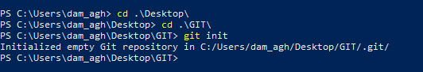
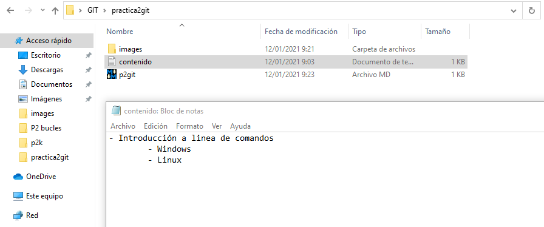
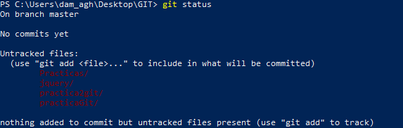

# Práctica 2 en Git

Inicializamos un repositorio en Git con el comando git init.

Creamos un fichero .txt llamado contenido y lo introducimos en una nueva carpeta llamada practica2git.

Tras esto comprobamos el estado del repositorio.

