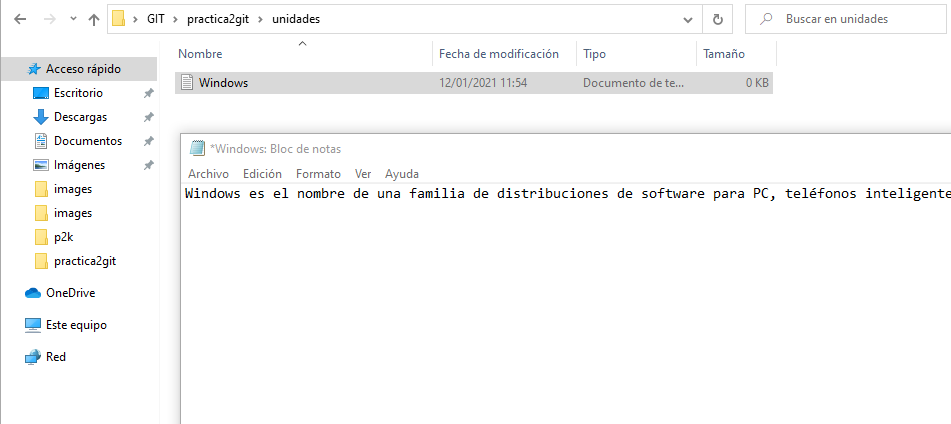
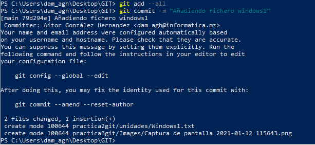

# Práctica 3 en Git

Lo primero que haremos es crear una nueva carpeta en el repositorio que tenemos de Entornos, dentro de "practica2git" y dentro de esa carpeta creamos un fichero .txt llamado windows1.

Añadimos los cambios a la zona de preparado y realizamos un commit.

